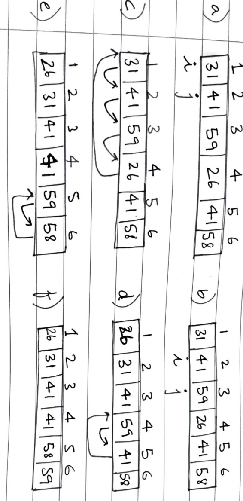

## 2.1 Insertion Sort

**Psuedocode** is a plain language description of the steps in an algorithm or another system as it has the structure of programming language it shouldn't be hard to understand if you have some knowledge on programming languages.

**Insertion sort** is efficient for sorting a small number of elements. It sort of works like if you had cards in the right hand you switch them to the left in the correct order. To find the correct position we compare the positions from right to left and place the card. At all times the cards in the left hand are always sorted.


for j = 2 to A.length
	key = A[j]
	// insert A[j] into sorted sequence
	i = j - 1
	while i > 0 and A[i] > key
		A[i + 1] = A[i]
		i = i - 1
	A[i + 1] = key


So, I was coding this and I ran into a couple of errors.
1. This is going to sound so dumb but that line: i = j - 1, I kinda skipped. Don't do that kids.

Let's break down the code (so that every time someone asks me to sort, bubble sort isn't my reflex action).

+ So, you have j iterating through the whole array starting at 2.
+ Now look at that next line, key = A[j]. Fix that in your brain. 'key' is like a temporary variable you're going to store A[j]'s value in. This is because when you move elements, just switching them, it's like having two full glasses of milk and water and wanting to switch the glass. You need that third glass otherwise you're gonna lose the information.
+ Assign i a value before j.
+ Now until i is greater than 0 and the value at a preceding index is greater than the key, you wanna keep shifting the value. A[i + 1] = A[i] and then go on to a previous i. The magic in this is, every time you pick up a key, all the elements to its left shall be sorted.
+ So, it's like every time you pick up a new key, compare it with every value preceding it and shift the key to its correct position, and finally, A[i + 1] = key.

Here is the code in C and Python


#include <stdio.h>
#define LENGTH(array) (sizeof(array)/sizeof(array[0])

void insertion_sort(int* A, int size) {
	int key;
	for(int j = 2; j <= size; j++) {
		key = A[j];
		// insert A[j] in sorted sequence
		int i = j - 1; // important line
		while (i > 0 && A[i] > key) {
			A[i + 1] = A[i];
			i = i - 1;
		}
		A[i + 1] = key;
	}
	printf("\nSorted Array\n");
	for(int j = 0; j < size; j++)
		printf("array[%d]: %d\n", j, A[j]);
}

void main() {
        int size;
        printf("Enter the size of the array: ");
        scanf("%d", &size);
        int array[size];
        for(int i = 0; i < size; i++) {
                printf("array[%d]: ", i);
                scanf("%d", &array[i]);
        }
        insertion_sort(array, size);
}



def insertion_sort(array):
   for j in range(2, len(array)):
      key = array[j]
      # insert A[j] into the sorted sequence
      i = j-1 # important line
      while i >=0 and array[i] > key:
         array[i+1] = array[i]
         i = i-1
      array[i+1] = key

array = []
n = int(input("Enter size of array: "))
for i in range(0, n): 
    element = int(input()) 
    array.append(element)
insertion_sort(array)
print("The sorted array is:")
for i in range(len(array)):
   print(array[i])


There are three parts that make for an algorithm:
+ **Initialization**: First iteration of a loop. Like here we start at j = 2.
+ **Maintenance**: True before iteration of a loop and remains true in the next iteration. Like the for loop and the while loop we encounter.
+ **Termination**: When the loop terminates, the invariant(property of a mathematical object which remains unchanged) gives us a useful property that the algorithm is correct. When the first two properties hold true, the loop invariant is true prior to every loop iteration. It's like mathematical induction where you have to prove every preceding step is true and this corresponds to the correctness of the algorithm. But it also differs from induction, as in induction we apply the inductive step infinitely and here we stop the induction and the loop terminates. For this case, the termination statement is in the for loop, j > A.length. 

### Pseudocode

+ "for", "while", "repeat-until", and "if-else" are from programming languages.
+ "//" for comments.
+ i = j = e are mutiple assignments.
+ "A.length" is an attribute of that object.
+ Passing is done by value thus only a copy of the parameters are received.
+ "return" passes values to its caller.
+ Boolean expressions like "and" and "or" are used for **short-circuiting**.
+ "error" specifies error and no solution to solve itis given.

Extra Resources: To get amazing explanations of all the sorting algorithms try [mycodeschool](https://www.youtube.com/user/mycodeschool) on YouTube. He explains everything so well and his voice is pretty calming too. Here's is his [insertion sort video](https://youtu.be/i-SKeOcBwko).

## Exercises

2.1-1) Using Figure 2.2 as a model, illustrate the operation of insertion sort on the array A = (31, 41, 59, 26, 41, 58).

2.1-2) Rewrite the insertion sort procedure to sort into non-increasing instead of non-decreasing order.

Just need to change one little detail in the code. A[i] > key needs to become A[i] < key.


def insertion_sort_dsc(array):
   for j in range(2, len(array)):
      key = array[j]
      # insert A[j] into the sorted sequence
      i = j-1 # important line
      while i >=0 and array[i] < key :
         array[i+1] = array[i]
         i = i-1
      array[i+1] = key

array = []
n = int(input("Enter size of array: "))
for i in range(0, n): 
    element = int(input()) 
    array.append(element)
insertion_sort(array)
print("The sorted array is:")
for i in range(len(array)):
   print(array[i])


2.1-3) Consider the searching problem:  
Input: A sequence of n numbers A = (a_1, a_2, ... a_n) and a value *v*.  
Output: An index i such that *v* = A[i] or the special value NIL if does not appear in A.  
Write pseudo-code for linear search, which scans through the sequence, looking for *v*. Using a loop invariant, prove that your algorithm is correct. Make sure that your loop invariant fulfills the three necessary properties.


def linear_search(array, target):
    for i in range(0, len(array)):
       if array[i] == target:
           return i
    return -1


Here is the code in C and Python.


#include <stdio.h>
#define LENGTH(arr) (sizeof(arr)/sizeof(arr[0]))

int linear_search(int * arr, int target) {
        for(int i = 0; i <= (LENGTH(arr)+1); i++)
                if(target == arr[i])
        		return i;
	return -1;
}

void main() {
        int size;
        printf("Enter the size of the array: ");
        scanf("%d", &size);
        int array[size];
        for(int i = 0; i < LENGTH(array); i++) {
                printf("array[%d]: ", i);
                scanf("%d", &array[i]);                                           
        }                                                                         
        int target;
        printf("Enter the element to find: ");
        scanf("%d", &target);
        linear_search(array, target);
	for(int i = 0; i < LENGTH(array); i++)                                    
                printf("%d ", array[i]);                                          
}



def linear_search(array, target):
    flag = 0
    for i in range(0, len(array)):
       if array[i] == target:
           return i
    return -1

array = []
n = int(input("Enter size of array: "))
for i in range(0, n): 
    element = int(input()) 
    array.append(element)
target = int(input("Enter an element to find in the array: "))
print("Target element found at index: ", linear_search(array, target))


2.1-4) Consider the problem of adding two n-bit binary integers, stored in two n-element arrays A and B. The sum of the two integers should be stored in binary form in an (n+1)-element array C. State the problem formally and write pseudocode for adding the two integers.


def addBinary(int[] a, int[] b, size):
	int c[size+1]
	int carryover = 0, sum = 0
	for (int i = 0, j = 0, i < a.length, j < b.length, i++, j++):
		sum = carry
		if (a[i] == 1 and b[i] == 1):
			carry = 1
		if ((a[i] == 1 and b[i] == 0) or (a[i] == 1 and b[i] == 0)):
			carry = 0
		if (a[i] == 1 and b[i] == 1):
			carry = 0
		if((sum == 1 and carry == 1)):  
			c[i] = 1
			c[i] = 0


Yeah, this solution isn't gonna work out. Google it and most solutions are a string manipulation question of LeetCode(question no. 67). But I wanted like an easier version. Link: <https://stackoverflow.com/questions/57506407/adding-two-binary-numbersinteger-array> (yep -2 upvotes). 


for(int i = 34; i >= 0; i--, p--) {
    switch(a[i] + b[i] + carry) {
    case 0:
        temp[p] = 0;
        carry = 0;
        break;
    case 1:
        temp[p] = 1;
        carry = 0;
        break;
    case 2:
        temp[p] = 0;
        carry = 1;
        break;
    case 3:
        temp[p] = 1;
        carry = 1;
        break;
    default:
        // should never be reached with inputs of 0 or 1
        throw std::invalid_argument("invalid input");
    }
}


Does this solution go backwards? I'm gonna sit and edit this solution to move forward.


int[] addBinary(int a[], int b[], size) {
	int temp[size+1]
	int carry = 0, sum = 0
	for (int i = 0, p = 0; i < a.size; i++, p++) {
		switch(a[i] + b[i] + carry) {
    			case 0:
        			temp[p] = 0;
        			carry = 0;
        			break;
    			case 1:
        			temp[p] = 1;
        			carry = 0;
        			break;
    			case 2:
        			temp[p] = 0;
        			carry = 1;
        			break;
    			case 3:
        			temp[p] = 1;
        			carry = 1;
        			break;
    			default:
        			// should never be reached with inputs of 0 or 1
        			throw std::invalid_argument("invalid input");
    		}
	}
}


Yep, this is how I would solve it.

The generic solution to this problem: [Leetcode Problem: 67, addBinary] and comments that explain it. Interesting fact: Both Nick White and Kevin Naughton Jr. had the exact same solutions. Hmmmmmmm. Maybe it's like a general lack of creativity (or not).

First now them basics: <https://circuitglobe.com/binary-addition-and-subtraction.html>.


class Solution {
	public String addBinary(String a, String b) {
		StringBuilder sb = new StringBuilder(); // in Java this is how you build strings
		int i = a.length - 1;
		int j = b.length - 1;
		int carry = 0;
		// got to start at least significant bit

		while (i >= 0 || j >= 0) { // traverse both the strings completely you don't want to stop if String a has lesser digits than String b
			int sum = carry;
			if ( i >= 0) += a.charAt(i) - '0'; // converts character to integer
			if ( j >= 0) += b.charAt(j) - '0';
			sb.append(sum % 2); // if both of the sums we were looking at were 1 it appends 0
			carry = sum / 2; // and you carry the 1 
			i--;
			j--;
		}
		if (carry != 0) sb.append(carry); // for the most significant bit
		return sb.reverse.toString(); // because append puts things at the end we would reverse the whole string
	}
}


## 2.2 Analyzing Algorithms

We need to **analyze** algorithms to compute how many resources(memory, communication, bandwidth, and computer hardware) they shall require. We compute this comparing to a generic processor, **random-access machine**(RAM) model of computation where there is no concurrency in operations. It contains arithmetic instructions(add, subtract, multiply, divide, remainder, floor, and ceiling), data subroutines(load, store, and copy), and control(conditional and unconditional branching, subroutine calls, and return).

### Analysis of Insertion Sort

Time taken by insertion-sort depends on the input, and so we describe the time taken as the size of the input. The **running time** of an algorithm is the primitive steps executed by it.

### Worst-case and Average-case Analysis

Worst-case running time is the longest-running time it would take for the algorithm on size n, it gives the upper bound and we then know for sure that the time shall not exceed it. Most of the time the worst-case fails, it's only in situations like if you were searching and the data isn't in the database.

Average-case is roughly as bad as the worst-case. // need to add

This book analyzes algorithms probabilistically. Also, we write **randomized algorithms**, which makes random choices to allow the **probabilistic analysis** and yields an **expected time**.

### Order of Growth

Running time that really interests us. If we had (an^2 + n) then we ignore the coefficient of n^2 and n, since they are insignificant. Thus, insertion sort has a worst-case running time of O(n^2). It might be that an algorithm of higher-order takes more time than that of a smaller order but for a large amount of inputs, this won't be the case.

## Exercises

2.2-1) Express the function n^3/1000 - 100n^2 -100n + 3 in O-notation.

O(n^3).

2.2-2) Consider sorting n numbers stored in array A by first finding the smallest element of A and exchanging it with the element in A[1]. Then find the second smallest element of A, and exchange it with A[2]. Continue in this manner for the first n-1 elements of A. Write pseudocode for this algorithm, which is known as selection sort. What loop invariant does this algorithm maintain? Why does it need to run for only the first n-1 elements, rather than for all n elements? Give the best-case and worst-case running times of selection sort in Big-O notation.

Selection sort psuedocode


def selection_sort(array):
	int min, j = 0, flag = 0
	while flag < array.size:
		for i = flag in array:
			if min > array[i]
				min = array[i]
				flag = flag + 1
		swap(array[j], min)
		j++


// needs edits

2.2-3) Consider linear search again (see Exercise 2.1-3). How many elements of the input sequence need to be checked on the average, assuming that the element being searched for is equally likely to be any element in the array? How about in the worst case? What are the average-case and worst-case running times of linear search in Big-O notation? Justify your answers.

On average the linear algorithm would have to search half the elements n/2, O(n/2) = O(n). The worst case of the algorithm would be O(n), meaning it searches through all the numbers. 

2.2-4) How can we modify almost any algorithm to have a good best-case running time?

Funky question. What if we made our algorithm only take in perfect inputs, like elements that don't require sorting in the first place? Yeah, probably not. We could always try to make sure we don't put two loops consecutively and try to avoid the O(n^2) case. What else? Make sure memory consumption is kept to O(1). But I've noticed that sometimes when you reduce space complexity the time complexity increases. One example is merging two sorted arrays. Like if you think of this traditionally, you take two elements from either array compare them, and place the smaller of the two elements in a new result array. But if you were to reduce space complexity, make it O(1) then you'd need to place another while loop in the for loop that shifts elements, thereby resulting in a time complexity of O(n^2).

- [ ] Will have to write code that explains this.

Okay, so it is a thing. Handling both complexities could mean one of them suffers.

> You might have two different optimization goals, that might sometimes conflict with each other. For example, to optimize the code for performance might conflict with optimize the code for less memory footprint and size. You might have to find a balance. 

(Source: <https://www.thegeekstuff.com/2015/01/c-cpp-code-optimization/>)

Branchless programming is another thing I came across recently. Here's a video that explains it pretty well: <https://youtu.be/bVJ-mWWL7cE> by Creel. Now I haven't watched Creel as much but this video does a pretty good explanation of something I've never been able to wrap my head around. Also, switch cases all the way baby. I don't know I've always wanted to get like an in-depth understanding of how jump tables work.

Edit: Creel looks like one of those YouTubers that deep dives into the basics of everything. There's a lot of computer architecture videos there and yeah, definitely think I should check him out.

- [ ] Jump tables and their inner workings.
- [ ] Understand jump tables and their inner workings.

Loops can optimized in weird ways...


for (i = 0; i < 10; i++) // not optimized
for (i = 10; i--; ) // optimized but not readable


I don't know if this question is asking about all these small things to optimize code (like don't use cout but use printf instead) but I feel like it's anyways these small details that contribute to the code and can effectively optimize any algorithm (given the language you use. I hope you don't use Python, because it is pretty damn slow). I personally feel like I'm gonna put my feet back in C++ and really just stick to it once I get the time to learn some of it's advanced concepts. Books: <https://github.com/rigtorp/awesome-modern-cpp> also, this guide: <https://github.com/mcinglis/c-style>. (Man, this reading list just keeps getting longer and longer).

But this would definitively be my reply to optimizing just any piece of code.

Answer on the github guide: You can modify any algorithm to have a best case time complexity by adding a special case. If the input matches this special case, return the pre-computed answer.

I'm going to facepalm myself. Okay, first off what kind of answers are these? Man.

A better answer in the Rutgers guide:

> For a good best-case running time, modify an algorithm to first randomly produce output and then check whether or not it satisfies the goal of the algorithm. If so, produce this output and halt. Otherwise, run the algorithm as usual. It is unlikely that this will be successful, but in the best-case the running time will only be as long as it takes to check a solution. For example, we could modify selection sort to first randomly permute the elements of A, then check if they are in sorted order. If they are, output A. Otherwise run selection sort as usual. In the best case, this modified algorithm will have running time Θ(n).

Basically, the answer I rejected is correct? I don't know, my mind shall never settle on that answer being totally correct. I think it's a combination of your coding style, algorithm, and the input that really consolidates the lead. I may be completely off, but I can't accept the fact that the best algorithm just knows how to the best-case input efficiently, I mean sure that's helpful but it definitely isn't the complete picture.

## 2.3 Designing Algorithms

For insertion sort, we used an **incremental** approach. In this section, we examine an alternative design approach, known as **“divide-and-conquer”**. Here the worst-case running time is much less than that of insertion sort and often their running times are easily determined.

### 2.3.1 The divide-and-conquer approach

Many algorithms use **recursion** to solve problems, they use the divide-and-conquer approach. They break the problem into several subproblems that are similar to the original problem but smaller in size, solve the subproblems recursively, and then combine these solutions to create a solution to the original problem.

+ Divide: the problem into a number of subproblems that are smaller instances of the same problem.
+ Conquer: the subproblems by solving them recursively. If the subproblem sizes are small enough, however, just solve the subproblems in a straightforward manner.
+ Combine: the solutions to the subproblems into the solution for the original problem.

Merge-sort algorithm follows this approach.

+ It divides the n-element sequence to n/2 subsequences.
+ It sorts the two subsequences recursively using merge sort.
+ It then merges the two sorted subsequences to produce the sorted sequence.

The recursion "bottoms out" when the sequence to be sorted has length 1, because then the array is already sorted.

The key operation in merge-sort is merging of two sorted subsequences in the **combine** step. We call MERGE(A, p, q, r), where A is the array, p, q and r are indices in the array such that p <= q < r. The procedure assumes that the subarrays A[p ... q] and A[q+1 ... r] are sorted and merges them to form A[p .. r]. Here, MERGE procedure takes time of O(n), where n = r - p + 1 is the total elements being merged.

If you have two sorted piles of cards and you were to merge them, then you'd select a card from either pile, compare them, and place the smallest one in the new sorted pile. This takes O(n) time. The following pseudocode implements this. Here, we also place a **sentinel** card at the bottom of the pile, which has a special value to simplify code. Here it has the value: infinity. Once the sentinel card is exposed that means all the non-sentinel cards of that list have already been placed. But here, we also know that we have to do this exactly r - p + 1 times.


MERGE(A, p, q, r):
	n_1 = q - p + 1
	n_2 = r - q
	let L[1 ... n_1 + 1] and R[1 ... n_2 + 1] be new arrays
	For i = 1 to n_1:
		L[i] = A[p + i - 1]
	for j = 1 to n_2:
		R[j] = A[q + j]
	L[n_1 + 1] = infinity
	R[n_2 + 1] = infinity
	i = 1
	j = 1
	for k = p to r:
		if L[i] <= R[j]:
			A[k] = L[i]
			i = i + 1
		else 
			A[k] = R[j]
			j = j + 1


First, we compute the length of sub-array n_1 and n_2. Then, we create two subarrays L and R, and place elements A[p ... q] in L and A[q + 1 ... r] in R. Then, we place sentinel values at n_1 +1 and n_2 + 1 positions of the arrays L and R respectively. After that we start another for loop from p to r comparing elements in both the arrays L and R and placing the smaller of the two onto A. This procedure has O(n) time complexity.

MERGE routine is a subroutine of MERGE-SORT. MERGE-SORT(A, p, r) sorts elements in the subarray A[p ... r]. If p >= r, then the subarray has at most one element and is already sorted. Otherwise q is computed as (p + r)/2 making two sub-arrays A[p ... q] and A[q+1 ... r] both containing n/2 elements.


MERGE-SORT(A, p, r):
	if p < r:
		q = ceil(p + r/2)
		MERGE-SORT(A, p, q)
		MERGE-SORT(A, q + 1, r)
		MERGE(A, p, q, r)


To sort the whole array, we call MERGE-SORT(A, 1, A.length), where A.length = n. First they are broken to one item sequences which are already sorted and then combined into two sorted elements, then four, 2^k (for k = 0, 1, 2, 3 ...). Until finally two sorted arrays of n/2 are combined in the last step.

### 2.3.2 Analyzing divide-and-conquer algorithms

When an algorithm contains a call to itself we call it a **recurrence**. 

2.3-1) Using Figure 2.4 as a model, illustrate the operation of merge sort on the array A = (3, 41, 52, 26, 38, 57, 9, 49).

2.3-2) Rewrite the MERGE procedure so that it does not use sentinels, instead of stopping once either array L or R has had all its elements copied back to A and then copying the remainder of the other array back into A.

I don't we need sentinel values, in any case. So maybe we just remove the lines?


def MERGE(A, p, q, r):
        n_1 = q - p + 1
        n_2 = r - q
        for i = 1 to n_1:
                L[i] = A[p + i - 1]
        for j = 1 to n_2:
                R[j] = A[q + j]
        i = 1
        j = 1
        for k = p to r:
                if L[i] <= R[j]:
                        A[k] = L[i]
                        i = i + 1
                else:
			A[k] = R[j]
			j = j + 1



def MERGE-SORT(A, p, r):
	if p < r:
		q = ceil((p + r)/2)
		MERGE-SORT(A, p, q)
		MERGE-SORT(A, q + 1, r)
		MERGE(A, p, q, r)


2.3-3) Use mathematical induction to show that when n is an exact power of 2, the solution of the recurrence

2.3-4) We can express insertion sort as a recursive procedure as follows. In order to sort A[1 ... n], we recursively sort A[1 ... n - 1] and then insert A[n] into the sorted array A[n - 1]. Write a recurrence for the running time of this recursive version of insertion sort.

2.3-5) Referring back to the searching problem (see Exercise 2.1-3), observe that if the sequence A is sorted, we can check the midpoint of the sequence against and eliminate half of the sequence from further consideration. The binary search algorithm repeats this procedure, halving the size of the remaining portion of the sequence each time. Write pseudocode, either iterative or recursive, for binary search. Argue that the worst-case running time of binary search is O(lg n).I


def BINARY-SEARCH(A, target):
	int left = 0, right = A.length, location = -1
	for i = 1 to A.length:
		mid = (left + right)/2
		if target < A[mid]:
			right = mid - 1
			continue
		if target > A[mid]:
			left = mid + 1
			continue
		if target == A[mid]
			location = i


2.3-6) Observe that the while loop of lines 5–7 of the INSERTION-SORT procedure in Section 2.1 uses a linear search to scan (backward) through the sorted subarray A[1 ... j - 1]. Can we use a binary search (see Exercise 2.3-5) instead to improve the overall worst-case running time of insertion sort to O(n lg n)?

Binary search in insertion-sort... Huh? And then also making its complexity O(n log n). So, if we were thinking in terms of a binary search we find some kind of a middle-value and start placing values smaller than it before and the ones bigger after. We would need to do that recursively till the whole array is sorted. Which would mean in this sorting algorithm we are continuously searching for the correct location of each element through binary searches.

(I quit, googling the solution)

Funnily enough, <https://walkccc.github.io/CLRS/Chap02/2.3/> says it's impossible.

GeeksforGeeks has a solution:


int binarySearch(int a[], int item, int low, int high) 
{ 
    if (high <= low) 
        return (item > a[low])?  (low + 1): low; 
  
    int mid = (low + high)/2; 
  
    if(item == a[mid]) 
        return mid+1; 
  
    if(item > a[mid]) 
        return binarySearch(a, item, mid+1, high); 
    return binarySearch(a, item, low, mid-1); 
} 
  
// Function to sort an array a[] of size 'n' 
void insertionSort(int a[], int n) 
{ 
    int i, loc, j, k, selected; 
  
    for (i = 1; i < n; ++i) 
    { 
        j = i - 1; 
        selected = a[i]; 
  
        // find location where selected sould be inseretd 
        loc = binarySearch(a, selected, 0, j); 
  
        // Move all elements after location to create space 
        while (j >= loc) 
        { 
            a[j+1] = a[j]; 
            j--; 
        } 
        a[j+1] = selected; 
    } 
}

Source: <https://www.geeksforgeeks.org/binary-insertion-sort/>

And already they have a while loop inside a for and still claim it to be O(log n), not even n log n?? Their python solution looks a little more O(n log n). But then again it's GeeksforGeeks, with a reputation given by either Indian geeks that are just going to suck up to it for having every problem's solution.


def binary_search(arr, val, start, end):
    # we need to distinguish whether we should insert
    # before or after the left boundary.
    # imagine [0] is the last step of the binary search
    # and we need to decide where to insert -1
    if start == end: 
        if arr[start] > val: 
            return start 
        else: 
            return start+1
  
    # this occurs if we are moving beyond left's boundary 
    # meaning the left boundary is the least position to 
    # find a number greater than val 
    if start > end: 
        return start 
  
    mid = (start+end)/2
    if arr[mid] < val: 
        return binary_search(arr, val, mid+1, end) 
    elif arr[mid] > val: 
        return binary_search(arr, val, start, mid-1) 
    else: 
        return mid 
  
def insertion_sort(arr): 
    for i in xrange(1, len(arr)): 
        val = arr[i] 
        j = binary_search(arr, val, 0, i-1) 
        arr = arr[:j] + [val] + arr[j:i] + arr[i+1:] 
    return arr

Rutgers is also like, nah man.

> A binary search wouldn’t improve the worst-case running time. Insertion sort has to copy each element greater than key into its neighboring spot in the array. Doing a binary search would tell us how many how many elements need to be copied over, but wouldn’t rid us of the copying needed to be done.

[Stackoverflow](https://stackoverflow.com/questions/18022192/insertion-sort-with-binary-search) led me to: <https://jeffreystedfast.blogspot.com/2007/02/binary-insertion-sort.html>.

Question: Is a binary insertion sort just tim sort?

This is a four part video series of Gaurav Sen explaining a hybrid sorting algorithm called Tim sort:

1. <https://youtu.be/emeME__917E>
2. <https://youtu.be/6DOhQyqAAvU> (even calling it binary insertion sort)
3. <https://youtu.be/Yk4CBisILaw>
4. <https://youtu.be/o8y9uYygLcw>

(Why is this question so big?)

Tim sort is the only thing that is a hybrid of insertion and merge (source: <https://hackernoon.com/timsort-the-fastest-sorting-algorithm-youve-never-heard-of-36b28417f399>) and so for the answers out there that just invalidate the question, you start to wonder if their solutions are even correct, or something to refer to.

- [ ] Create an algorithm for binary insertion sorting after watching those Gaurav Sen videos.

Extra resource: <https://github.com/ahampriyanshu/algo_ds_101/tree/master/Algorithms/Sorting_Algorithms>. I found this while snooping about Github during Hacktoberfest2020 searching for projects to contribute to, it has like almost every sorting algorithm I've heard of. 

2.3-7) ★ Describe a O(n lg n)-time algorithm that, given a set S of n integers and another integer x, determines whether or not there exist two elements in S whose sum is exactly x.

Black star on this question has already scared me.
